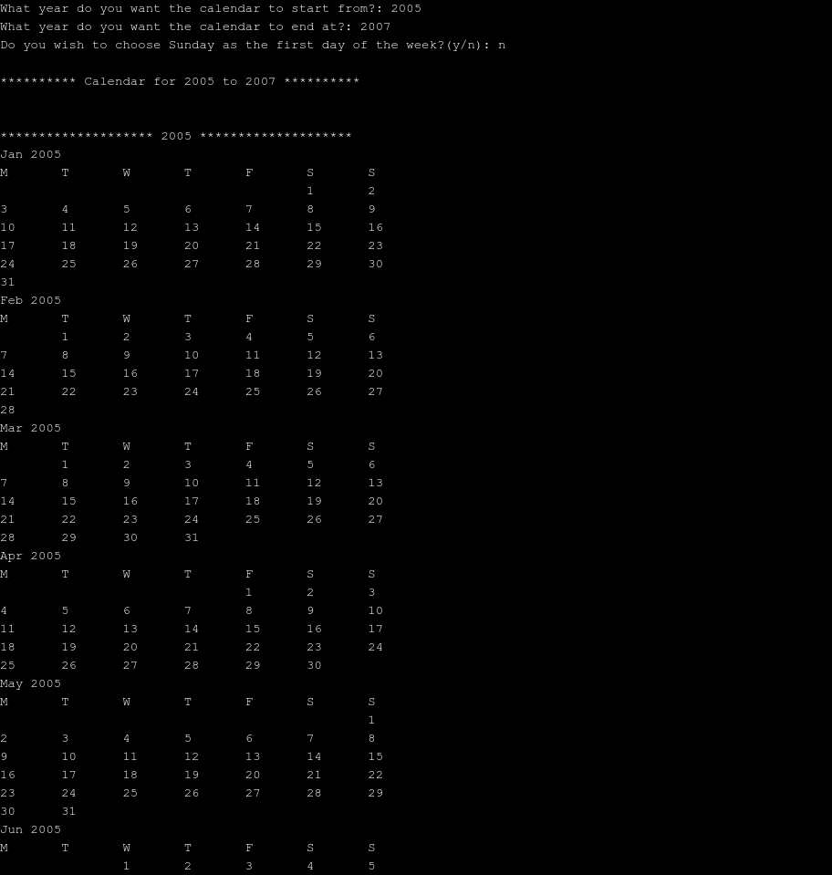

### SimpleCalendar

Ever wonder what weekday a particular day of the week was? Say... your birthday. Born on a Tuesday? No, maybe a Friday? This simple calendar can help you find out without having to hit that "back button" about a thousand times before you get to the specific year you want! Just type the year you want. Simple.  

Provide the starting year (which should be after 1899) and the ending year (before 2100), choose whether you want Monday or Sunday as the first day of the week, and that's it. 

  

<b>Let's Keep It Simple... Smart-y</b>

